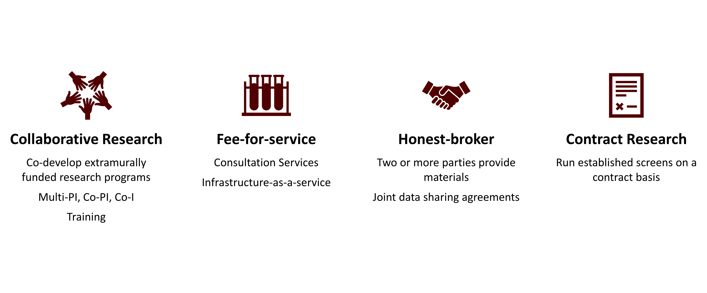

Our research facility is committed to fostering impactful collaborations that push the boundaries of medical science. Through the Gulf Coast Consortium (GCC), we actively seek partnerships with academic researchers, industry, and other stakeholders to address some of the most challenging and unmet medical needs. We believe that together, we can develop innovative solutions that make a real difference in patients' lives.

### Partner With Us to Drive Innovation
We offer multiple avenues for collaborative research, including pro-bono funding to support new investigators looking to make their mark in biomedical research. Our expertise is not only in providing access to unique instrumentation and infrastructure, but also in partnering with investigators to develop competitive grant applications that stand out in their fields. For students and post-docs, we provide hands-on training, ensuring the next generation of scientists has the skills and experience they need to succeed.

### Services and Expertise
We offer a wide range of fee-for-service options, including consulting, access to state-of-the-art infrastructure, and custom assay development. Our core strengths include:
- **Assay Development:** Tailored solutions to accelerate your research.
- **Consultation Services:** Expert advice from our experienced team.
- **Access to Unique Infrastructure:** Cutting-edge technologies that support your projects.

### Honest Broker and Industry Collaboration
Our facility also plays a unique role in acting as an honest broker, facilitating academic-private partnerships by managing and brokering materials and data in an impartial manner. We understand the importance of bridging the gap between academia and industry, and we strive to make these partnerships effective and transparent.

### Contract Research and Beyond
In addition to collaborative grants, we offer contract research opportunities designed to meet the specific needs of our partners. Whether you’re an academic researcher or an industry innovator, we are ready to support you with the expertise, infrastructure, and dedication needed to solve complex scientific challenges.

**We’re Open for Collaboration**
If you're looking to partner on cutting-edge medical research, we’re here to help. Together, we can take on the biggest challenges in healthcare and make a lasting impact. To get started, apply [here](https://forms.gle/cVc33Jtfk9ZALX9p6)

