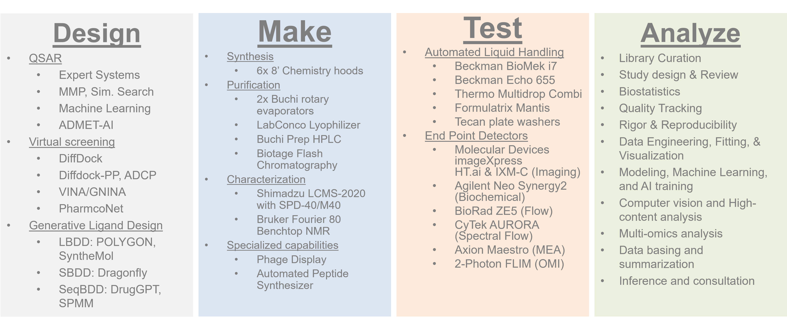

Our integrated drug discovery platform combines advanced capabilities in generative AI-driven ligand design, synthetic and medicinal chemistry, high-throughput screening, and data science to accelerate therapeutic development. Our Generative AI Platform leverages cutting-edge tools and models to design high-quality ligands, while our Synthetic and Medicinal Chemistry Program provides state-of-the-art infrastructure for synthesis and optimization. The High-Throughput Screening Center supports a broad range of assay formats and therapuetic modalities, and our Screening Informatics and Data Science Program ensures robust data analysis and visualization. Together, these programs offer a comprehensive, flexible solution for accelerating data driven discovery of novel therapeutics.

