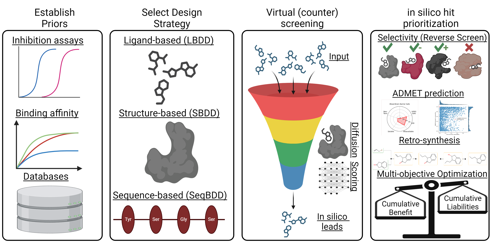

Our generative AI platform provides cutting-edge services for ligand design, leveraging the expertise of our highly skilled team. We begin each project with an in-depth evaluation of prospective targets, crafting a bespoke strategy that incorporates all available data, such as protein structure and biological activity where available.

Our platform is built on a rich foundation of AI-driven approaches. We have trained and databased multiple foundational generative chemistry models and quantitative structure-activity relationship (qSAR) models, allowing for rapid development and optimization for targets with established priors. Our design strategies integrate ligand-based techniques like variational autoencoders (VAE), active learning, Monte Carlo search, and qSAR.

We also utilize structure-based approaches, focusing on fragment growing and space-filling methods to design new molecules. Additionally, we are exploring sequence-based classification and generative techniques to further expand our capabilities.

Our virtual screening platform utilizes state-of-the-art tools, including Gnina, DiffDock, and PharmcoNet, to efficiently identify promising compounds. We also perform in silico derisking using ADMET (Absorption, Distribution, Metabolism, Excretion, and Toxicity) analysis to ensure the drug-likeness and safety profile of the designed compounds. Reverse docking is employed to assess specificity, while multi-objective optimization is used to propose the highest quality small molecules for further development, optimizing for factors such as synthetic accessibility and drug-likeness.

We offer these services as part of a collaborative framework that synergizes seamlessly with our other core programs, including synthetic chemistry and high-throughput screening (HTS). Together, we provide a comprehensive solution for the rational design and development of small molecule and peptide therapeutics.

